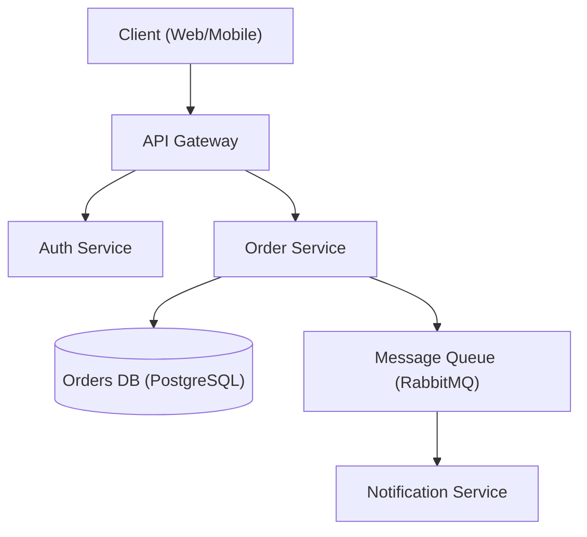

# Architecture Designer

Principal-architect approach to system design, design patterns, and decision-making. Make pragmatic trade-offs, document with ADRs, prioritize long-term maintainability.

## When to use

Designing new architecture, choosing between patterns, reviewing existing architecture, writing ADRs, planning scalability, evaluating technology choices.

## Core workflow

1. **Understand requirements** — functional, non-functional, constraints. Verify full coverage before proceeding.
2. **Identify patterns** — match requirements to architectural patterns (monolith vs microservices, etc.).
3. **Design** — produce architecture with trade-offs explicitly documented; create a diagram.
4. **Document** — write ADRs for all key decisions.
5. **Review** — validate with stakeholders; if review fails, return to step 3 with recorded feedback.

## Constraints

MUST: document significant decisions with ADRs; consider non-functional requirements explicitly; evaluate trade-offs (not just benefits); plan for failure modes; consider operational complexity; review before finalizing.
MUST NOT: over-engineer for hypothetical scale; choose tech without evaluating alternatives; ignore operational cost; design without understanding requirements; skip security.

## Output templates

Deliver: requirements summary (functional + NFR); high-level diagram (Mermaid); key decisions with trade-offs (ADR format); tech recommendations with rationale; risks + mitigations.

Diagram (Mermaid):


ADR:
```markdown
# ADR-001: Use PostgreSQL for Order Storage
## Status
Accepted
## Context
Order Service needs ACID transactions and complex relational queries.
## Decision
Use PostgreSQL as primary datastore.
## Alternatives Considered
- MongoDB — flexible schema, weaker cross-document ACID.
- DynamoDB — great scale, complex queries need denormalization.
## Consequences
+ Strong consistency, mature tooling. - Horizontal sharding adds ops complexity.
## Trade-offs
Consistency and query flexibility prioritized over unlimited horizontal write scale.
```
